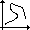

# lrm-extensions

lrm-extensions is a plugin for leaflet-routing-machine. With this plugin, you can:
- switch between Mapbox, Mapzen or Graphhopper as routing engine, using buttons in the control
- switch between car, bike or pedestrian, using buttons in the control
- export the route to a GPX file
- transform the route into a leaflet polyline

See the [demo](http://wwwouaiebe.github.io/lrm-extensions/) page.

## Before starting the demo

To access the routing engines, you need API keys ( also named access tokens). Visit [Mapbox] (https://www.mapbox.com/studio/signup/?plan=starter),
[Mapzen] (https://mapzen.com/developers/sign_in) and/or [GraphHopper] (https://graphhopper.com/dashboard/#/register) to obtain an API key.

Notice also that when you don't have any API key, lrm-extensions uses OSRM as routing engine. Remember that OSRM is only usable for demo and not for production. 
See [OSRM usage policy] (https://github.com/Project-OSRM/osrm-backend/wiki/Api-usage-policy).

## How it's work

Depending of the API keys you have given, a button is added in the control for each routing engine. Click on a button to change the routing engine.
Click on the button 'bike' , 'pedestrian'  or 'car'  to change the transit mode
Click on the 'GPX' button  to download the gpx file
Click on the 'polyline' button  to transform the route into polyline. In the dialog box, select a color, a width and eventually a name for the polyline.
Click on the 'clean all waypoints' button  to completely remove the route

### Editing polylines

When a polyline is added to the map, you can change the color, the width or the name with a right click on the polyline and then select edit in the menu. You can also remove the polyline with the delete button in the menu.
When a name is added in a polyline, the name is visible in a tooltip.